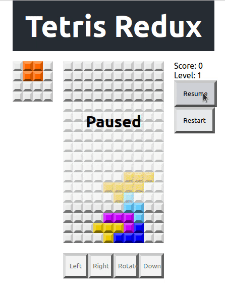

# React Tetris

## About The Project

React Tetris is a tetris clone built in React. The motiviation of this project was just to build a simple game using React and Typescript, following this [tutorial](https://makeschool.org/mediabook/oa/tutorials/react-redux-tetris-app-tutorial-o4s/tetris-introduction/). Instead of Javascript, I worte the application in Typescript and added some additional tooling for fun.

### Built With
- React
- Redux
- Typescript

## Demo


## Getting Started

### Prerequsites
- Node
- Yarn

### Installation
1) Install dependencies
```
yarn
```

2) (Optional) Copy the `.env.example` and rename it to `.env`. You can use this file to change the running port.
```
cp .env.example .env
```

3) You can now start the development server to run this application.
```
yarn start
```

## License
MIT License

Copyright (c) [2022] [Nicholas Chumney]

Permission is hereby granted, free of charge, to any person obtaining a copy
of this software and associated documentation files (the "Software"), to deal
in the Software without restriction, including without limitation the rights
to use, copy, modify, merge, publish, distribute, sublicense, and/or sell
copies of the Software, and to permit persons to whom the Software is
furnished to do so, subject to the following conditions:

The above copyright notice and this permission notice shall be included in all
copies or substantial portions of the Software.

THE SOFTWARE IS PROVIDED "AS IS", WITHOUT WARRANTY OF ANY KIND, EXPRESS OR
IMPLIED, INCLUDING BUT NOT LIMITED TO THE WARRANTIES OF MERCHANTABILITY,
FITNESS FOR A PARTICULAR PURPOSE AND NONINFRINGEMENT. IN NO EVENT SHALL THE
AUTHORS OR COPYRIGHT HOLDERS BE LIABLE FOR ANY CLAIM, DAMAGES OR OTHER
LIABILITY, WHETHER IN AN ACTION OF CONTRACT, TORT OR OTHERWISE, ARISING FROM,
OUT OF OR IN CONNECTION WITH THE SOFTWARE OR THE USE OR OTHER DEALINGS IN THE
SOFTWARE.

## Contact

Nicholas Chumney - [nicholas.chumney@outlook.com](nicholas.chumney@outlook.com)

## Acknowledgements
- [React Redux Tetris Tutorial](https://makeschool.org/mediabook/oa/tutorials/react-redux-tetris-app-tutorial-o4s/tetris-introduction/)